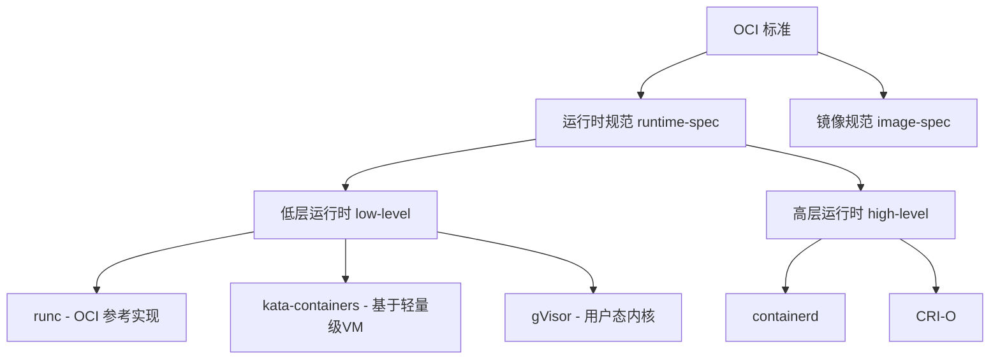

---
tags:
  - container
  - docker
  - containerd
  - 容器运行时
  - 云原生
  - 基础知识
created: 2026-06-04
aliases:
  - 容器原理
  - Container技术
---

# 容器技术原理

## 一、概述

容器是一种操作系统级虚拟化技术，通过将应用及其依赖打包到一个轻量级、可移植的独立环境中运行。与虚拟机不同，容器共享宿主机操作系统内核，因此启动更快、资源开销更小。容器技术是现代云原生架构的基石。

## 二、核心概念

### 2.1 容器 vs 虚拟机

| 特性 | 容器 | 虚拟机 |
|------|------|--------|
| **隔离层级** | 进程级（共享宿主机内核） | 硬件级（每个 VM 有独立 OS） |
| **启动速度** | 秒级/毫秒级 | 分钟级 |
| **资源开销** | MB 级（仅应用 + 依赖） | GB 级（完整 OS + 应用） |
| **密度** | 单机可运行数百至数千容器 | 单机通常数十个 VM |
| **隔离强度** | 较弱（共享内核） | 强（硬件辅助隔离） |
| **可移植性** | 高（镜像一次构建，到处运行） | 受虚拟化平台限制 |

### 2.2 容器核心原理

容器本质上是 Linux 内核特性的组合，主要依赖以下技术：

#### （1）Namespace（命名空间隔离）
提供进程视图隔离，每种 Namespace 隔离一类系统资源：

| Namespace | 隔离内容 | 内核版本 |
|-----------|----------|----------|
| **Mount** | 文件系统挂载点 | Linux 2.4.19 |
| **UTS** | 主机名和域名 | Linux 2.6.19 |
| **IPC** | 进程间通信（信号量、消息队列） | Linux 2.6.19 |
| **PID** | 进程 ID 编号空间 | Linux 2.6.24 |
| **Network** | 网络设备、IP 地址、路由表 | Linux 2.6.29 |
| **User** | 用户和用户组 ID | Linux 3.8 |
| **Cgroup** | 控制组根目录 | Linux 4.6 |
| **Time** | 系统时钟 | Linux 5.6 |

#### （2）Cgroups（控制组）
对资源使用进行限制、审计和隔离：

- **cpu**：限制 CPU 使用率
- **memory**：限制内存使用量
- **blkio**：限制块设备 I/O
- **net_cls**：标记网络包，配合流量控制
- **devices**：控制设备访问权限

#### （3）UnionFS（联合文件系统）
将多个目录/文件系统叠加成一个统一视图，实现：

- **镜像分层**：每层只存储增量变化
- **写时复制（Copy-on-Write）**：共享基础层，修改时才复制
- **存储复用**：同一基础镜像的容器共享底层，节省磁盘

常用 UnionFS 实现：
- **OverlayFS**（推荐，已合并到 Linux 内核主线）
- **AUFS**（早期 Docker 默认，现已被 OverlayFS 取代）
- **Device Mapper**（Red Hat 生态）

## 三、容器运行时

### 3.1 容器运行时生态

容器运行时负责运行容器，遵循不同标准：



### 3.2 runc — OCI 标准运行时

**runc** 是 OCI（Open Container Initiative）的参考实现：

- 轻量级、可移植的 CLI 工具
- 直接使用 Linux 内核特性（namespace、cgroups）创建和运行容器
- 遵循 OCI Runtime Specification
- Docker 和 containerd 默认使用 runc 作为底层运行时

### 3.3 containerd

**containerd** 是 CNCF 毕业项目，业界标准的容器运行时：

核心功能：
- 镜像管理（pull、push）
- 容器生命周期管理
- 存储管理（快照、挂载）
- 网络管理（通过 CNI 插件）
- **被 Docker 和 Kubernetes（CRI）使用**

架构特点：
- 基于 gRPC 的 API
- 默认使用 runc 运行容器
- 支持多租户和命名空间隔离

### 3.4 Docker 架构

Docker 的架构演进：

```
早期架构（Docker 1.x）：
  Docker CLI → Docker Daemon（单体，包含编排、网络、存储、运行时）

现代架构（Docker 18.09+）：
  Docker CLI → dockerd → containerd → containerd-shim → runc → 容器进程
```

Docker 内部组件：
- **dockerd**：Docker 守护进程，提供 REST API
- **containerd**：容器生命周期管理
- **containerd-shim**：容器进程的父进程，允许 runc 退出而不影响容器
- **runc**：创建和启动容器

## 四、容器镜像

### 4.1 镜像分层构建

Docker 镜像由多层只读层堆叠而成：

```
layer 6: 应用代码 (writable)
layer 5: 应用依赖 (pip install / npm install)
layer 4: 运行时环境 (JDK / Node.js)
layer 3: 基础库和工具
layer 2: 操作系统基础文件
layer 1: 基础系统层 (FROM scratch 或 alpine/ubuntu)
```

- 每一层对应 Dockerfile 中的一条指令
- **写时复制**：所有层只读，容器启动时在顶层添加可写层
- 缓存优化：未变更的层可复用，加速构建

### 4.2 OCI 镜像规范

OCI Image Specification 定义了标准镜像格式：

- **Image Manifest**：镜像元数据（层列表、配置信息）
- **Image Configuration**：运行时配置（环境变量、入口点、卷等）
- **Image Layer**：压缩的文件系统变更集（tar + gzip）

### 4.3 镜像仓库

- **Docker Hub**：Docker 官方公共仓库
- **Harbor**：CNCF 毕业的私有镜像仓库（企业级）
- **各大云厂商**：阿里云 ACR、AWS ECR、腾讯云 TCR 等

## 五、容器安全

### 5.1 安全分层防护

| 层次 | 安全措施 |
|------|----------|
| **镜像安全** | 镜像签名、漏洞扫描、最小化基础镜像 |
| **运行时安全** | 非 root 运行、只读根文件系统、Seccomp/AppArmor/SELinux |
| **网络安全** | 网络策略（Network Policy）、网络隔离 |
| **供应链安全** | SBOM、签名验证、可信镜像源 |

### 5.2 安全增强技术

- **Seccomp**：限制容器可用的系统调用
- **AppArmor / SELinux**：强制访问控制
- **Capabilities**：精细化权限控制（而非全量 root）
- **Rootless 容器**：以非 root 用户运行容器守护进程

## 六、信息来源

- [Docker 官方文档](https://docs.docker.com/)
- [containerd 官方文档](https://containerd.io/)
- [OCI - Open Container Initiative](https://opencontainers.org/)
- [Docker 底层技术详解 - InfoQ](https://www.infoq.cn/article/docker-kernel-knowledge-namespace-cgroups)
- [Linux Namespace 详解 - LWN.net](https://lwn.net/Articles/531114/)
- [《Docker 技术入门与实战》](https://book.douban.com/subject/30397159/) - 杨保华
