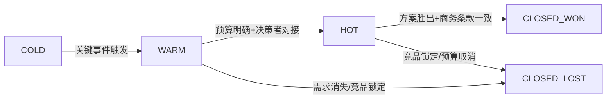

# BANT商机判断法

## 一、核心方法论

### 1.1 BANT模型概述

BANT是IBM提出的经典商机判断框架，用于快速评估销售机会的成熟度和优先级。

```
B → Budget     （预算）   → 客户有钱吗？
A → Authority  （决策权） → 我们能接触到决策者吗？
N → Need       （需求）   → 客户真的需要吗？
T → Timeline   （时间线） → 什么时候会做决定？
```

### 1.2 BANT变体：应对现代销售场景

| 维度 | 传统BANT | 现代BANT+ | 适用场景 |
|------|----------|-----------|----------|
| **Budget** | 是否有明确预算？ | 预算如何形成？谁来推动预算审批？ | 无明确预算但有战略需求的项目 |
| **Authority** | 决策者是谁？ | 决策链路是什么？影响者有哪些？ | 大企业多层级决策 |
| **Need** | 是否有需求？ | 需求的紧急程度和业务影响有多大？ | 需要激发需求的项目 |
| **Timeline** | 什么时候购买？ | 什么事件会驱动时间线？ | 时间不确定但事件驱动 |

### 1.3 新一代商机判断：MEDDIC

```
M → Metrics     （可衡量的价值）→ 项目的ROI是多少？如何衡量？
E → Economic Buyer（经济决策者）→ 谁有预算签字权？
D → Decision Criteria（决策标准）→ 客户如何评估和选择？
D → Decision Process （决策流程）→ 采购流程和步骤是什么？
I → Identify Pain （识别痛点）  → 为什么要改变？不改变的代价？
C → Champion     （支持者）     → 谁在内部帮你推动？
```

> 建议：BANT做初筛，MEDDIC做深度验证。

---

## 二、云计算项目评分标准

### 2.1 BANT评分矩阵（总分100分）

#### Budget（25分）

| 评分 | 标准 | 信号 |
|------|------|------|
| 25 | 预算已批复，金额明确 | 看到正式PO/预算批文 |
| 20 | 有预算来源，金额范围确定 | 客户口头确认预算 |
| 15 | 预算在规划中，有明确的资金来源部门 | 预算规划会议纪要 |
| 10 | 预算需要重新申请，但客户承诺推动 | 有预算申请时间表 |
| 5 | 无预算，但客户提到可从其他项目调配 | 调预算需多级审批 |
| 0 | 明确表示没有预算 | 或者预算与本项目规模严重不匹配 |

#### Authority（25分）

| 评分 | 标准 | 信号 |
|------|------|------|
| 25 | 已建立与最终决策者（VP/CTO/CIO）的直接沟通 | 当面或电话沟通过 |
| 20 | 已识别决策者，通过内部Champion建立了联系 | Champion定期向决策者汇报 |
| 15 | 已识别决策者，但尚未建立直接联系 | 只能通过中间人 |
| 10 | 已识别影响者但未触及决策者 | 只接触了技术评估层 |
| 5 | 仅接触基层使用方 | 无向上引荐 |
| 0 | 完全不了解客户的决策链路 | 盲打 |

#### Need（25分）

| 评分 | 标准 | 信号 |
|------|------|------|
| 25 | 需求被CTO/VP级明确背书，与战略目标直接挂钩 | 出现在年度IT规划中 |
| 20 | 需求明确，有量化目标和KPI | RFP中有明确的SLA要求 |
| 15 | 需求明确但未量化 | 口头表述清晰但无文档 |
| 10 | 需求模糊，在探索阶段 | 客户说"了解一下" |
| 5 | 不觉得有紧迫需求 | 应付了解一下 |
| 0 | 已有内部方案或竞品锁定 | 明确说"已经有了" |

#### Timeline（25分）

| 评分 | 标准 | 信号 |
|------|------|------|
| 25 | 3个月内签单，有明确的采购时间表 | 已发布招标公告 |
| 20 | 3-6个月签单，有时间节点但可能变化 | 内部立项完成 |
| 15 | 6-9个月，关键事件驱动 | 依赖其他项目 |
| 10 | 9-12个月，长期规划 | 出现在明年的计划中 |
| 5 | 12个月以上 | 技术预研性质 |
| 0 | 无明确时间 | 随口一问 |

### 2.2 云计算项目特殊加分项

| 加分项 | 分值 | 说明 |
|--------|------|------|
| 替换竞品 | +10 | 客户有明确的替换意愿（更容易切入） |
| 行业标杆 | +5 | 客户是行业头部，成单后有灯塔效应 |
| 紧急事件驱动 | +10 | 安全事件/故障/合规截止日期等 |
| 已有技术验证 | +8 | 客户已完成POC，认可技术 |
| 高层推动 | +10 | CXO级别直接发起 |
| 生态绑定 | +5 | 与客户已有其他产品合作 |

---

## 三、商机分级（Hot/Warm/Cold）

### 3.1 分级标准

```
🔥 HOT（热）  ≥ 80分
   特征：预算明确、决策者已对接、3个月内签单
   策略：全力投入，每周跟进，启动方案、POC、高层互访
   资源配置：售前+销售+架构师+管理层

🌡️ WARM（温） 55-79分
   特征：需求明确但预算/决策者未就绪，6个月内
   策略：培养Champion，建立技术信任，推动预算审批
   资源配置：售前+销售，定期维护

❄️ COLD（冷） < 55分
   特征：需求模糊、时间遥远、决策链不清晰
   策略：保持触达，行业活动邀请，等关键事件触发
   资源配置：销售维护，不投入售前资源
```

### 3.2 升级路径



### 3.3 降级触发条件

当出现以下信号时，Hot应降为Warm或Cold：

- 决策者失联超过2周
- 预算被其他项目占用
- 竞品已进入POC且反馈极好
- 客户明确推迟时间线>6个月
- 内部Champion离职或调岗

---

## 四、实战案例

### 案例1：某城商行容器平台项目

**初筛（BANT）**：

| 维度 | 评估 | 得分 |
|------|------|------|
| Budget | 有信创专项预算，300万已批复 | 25 |
| Authority | 已与CIO当面沟通，对方明确支持 | 25 |
| Need | 信创迁移截止2026年底，容器是刚需 | 25 |
| Timeline | 2026年Q3要完成POC，Q4招标 | 25 |
| 加分项：替换OpenShift | | +10 |
| **总分** | | **110** |

**分级**：🔥 HOT（远超80分）

**策略**：
- 第1周：安排CTO与客户CIO互访
- 第2-3周：完成POC环境搭建和核心场景验证
- 第4周：提交方案和商务报价
- 持续：每周1次进度同步会

**结果**：3个月签单，650万。

---

### 案例2：某制造业AI质检平台

**初筛（BANT）**：

| 维度 | 评估 | 得分 |
|------|------|------|
| Budget | AI项目有规划，但预算尚未独立申请 | 15 |
| Authority | 智能制造总监有兴趣，但最终需VP批 | 15 |
| Need | 质检效率低，但用传统方案也能勉强应付 | 15 |
| Timeline | 预计2027年启动 | 10 |
| 加分项：行业标杆 | | +5 |
| **总分** | | **60** |

**分级**：🌡️ WARM

**策略**：
- 组织行业案例分享会，邀请客户VP参加
- 提供免费技术咨询和可行性分析
- 帮客户做AI质检ROI测算
- 每2周1次技术交流

**结果**：6个月后VP参加行业峰会看到竞品已落地AI质检，紧急立项，3个月签单。

---

### 案例3：某互联网公司多云管理

**初筛（BANT）**：

| 维度 | 评估 | 得分 |
|------|------|------|
| Budget | 运维成本正常，无额外预算 | 5 |
| Authority | 仅接触运维经理，CTO不了解 | 5 |
| Need | 多云现状能跑，不觉得有痛点 | 10 |
| Timeline | 无计划 | 0 |
| **总分** | | **20** |

**分级**：❄️ COLD

**策略**：
- 保持每季度1次触达
- 邀请参加行业活动和社区Meetup
- 分享多云成本优化的白皮书
- 不投入售前资源

**结果**：9个月后云成本暴涨300%触发警报，客户主动联系，升级为WARM。

---

## 五、检查清单

### 初次拜访

- [ ] BANT四维度各收集了至少2条信息？
- [ ] 是否能给出BANT评分（总分）？
- [ ] 是否识别了至少1位潜在Champion？
- [ ] 是否了解了竞品在客户处的情况？
- [ ] 是否能说出客户的下一个关键时间节点？

### 商机评审

- [ ] BANT总分是否≥55分（值得跟进）？
- [ ] Authority维度是否有具体人名和职位？
- [ ] Need是否与客户的战略目标对齐？
- [ ] Timeline是否在12个月以内？
- [ ] 是否有明确的下一步动作？

### 每周复盘

- [ ] 所有HOT商机本周有进展吗？
- [ ] 哪些WARM可以升级？需要什么条件？
- [ ] 哪些商机需要降级？触发条件是什么？
- [ ] 是否有新的竞品情报？
- [ ] Champion关系是否在加强？

---

## 六、CRM使用规范

| 字段 | 填写要求 | 示例 |
|------|----------|------|
| 商机名称 | 客户简称 + 项目简称 + 预计金额 | 光大银行-容器平台PaaS-300万 |
| BANT评分 | 单项分+总分 | B25-A25-N25-T25=100 |
| 分级 | Hot/Warm/Cold | Hot |
| 预计签单日期 | YYYY-MM-DD | 2026-09-30 |
| 下一步 | 具体动作+负责人+截止日期 | 提交POC方案-张三-06/15 |
| 竞品情况 | 竞品名称+当前状态 | AWS-已完成POC |

---

*最后更新：2026-06-04*
